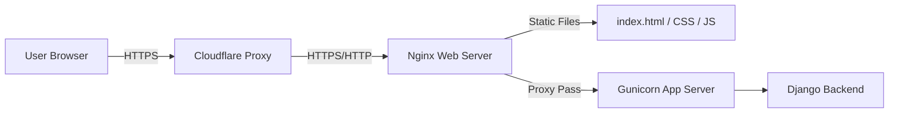

# AWS Free Tier Hosting Guide with Cloudflare DNS

This guide walks you through hosting your Django + HTML/CSS/JS website on the **AWS Free Tier** and connecting it to your domain managed in **Cloudflare**.

---

## Architecture Overview
To keep this hosting 100% free under the AWS Free Tier, we will deploy a full-stack architecture on a single virtual server (EC2 instance):
- **DNS & SSL**: Cloudflare (manages domain, provides free SSL certificate, CDN, and DDoS protection).
- **Web Server & Reverse Proxy**: Nginx (installed on EC2; handles requests, serves static files, and forwards dynamic requests to Gunicorn).
- **Application Server**: Gunicorn (runs the Python/Django application).
- **Database**: SQLite (stored on EC2 disk) or AWS RDS PostgreSQL/MySQL (RDS is free-tier eligible for 12 months).



---

## Step 1: Launch an AWS EC2 Instance (Free Tier)
AWS offers **750 hours per month** of a `t2.micro` (or `t3.micro`) instance for free for the first 12 months.

1. **Log in to the AWS Management Console** and navigate to the **EC2 Dashboard**.
2. Click **Launch Instance**.
3. **Name**: Enter a name (e.g., `inkify-server`).
4. **Application and OS Image (AMI)**: Choose **Ubuntu 22.04 LTS** or **Ubuntu 24.04 LTS** (ensure it says *"Free tier eligible"*).
5. **Instance Type**: Select `t2.micro` (or `t3.micro` if in a region where t2 is unavailable).
6. **Key Pair**: Click **Create new key pair**.
   - Key pair name: `inkify-key`
   - Key pair type: RSA
   - Private key file format: `.pem` (for OpenSSH/macOS/Linux/Windows PowerShell) or `.ppk` (for PuTTY).
   - Save the downloaded `.pem` file securely.
7. **Network Settings**:
   - Check **Allow SSH traffic from** (Select *My IP* for safety, or *Anywhere 0.0.0.0/0* if you need access from multiple networks).
   - Check **Allow HTTPS traffic from the internet**.
   - Check **Allow HTTP traffic from the internet**.
8. **Configure Storage**: Keep the default size (up to 30 GB of general-purpose SSD storage is free).
9. Click **Launch Instance**.

---

## Step 2: Assign an Elastic IP (Static IP)
By default, EC2 public IPs change every time the server stops or restarts. An Elastic IP is a static public IP that is **free** as long as it is associated with a running EC2 instance.

1. In the EC2 console left sidebar, under **Network & Security**, click **Elastic IPs**.
2. Click **Allocate Elastic IP address**.
3. Choose your region and click **Allocate**.
4. Select the newly allocated IP, click **Actions**, and choose **Associate Elastic IP address**.
5. Select **Instance**, choose your running `inkify-server` instance, and click **Associate**.
6. Copy this IP address (e.g., `54.210.xx.xx`).

---

## Step 3: Configure Cloudflare DNS
Cloudflare will handle SSL encryption, caching, and point your domain to AWS.

1. Log in to your **Cloudflare Dashboard** and select your domain.
2. Navigate to the **DNS** -> **Records** tab.
3. Add or update the following records:
   - **A Record (Root Domain)**:
     - Type: `A`
     - Name: `@`
     - IPv4 Address: Paste your **AWS Elastic IP**.
     - Proxy status: **Proxied** (Orange Cloud active).
   - **A Record (www Subdomain)**:
     - Type: `A`
     - Name: `www`
     - IPv4 Address: Paste your **AWS Elastic IP**.
     - Proxy status: **Proxied** (Orange Cloud active).
4. Save the records.

---

## Step 4: Secure Connection (SSL/TLS) Settings in Cloudflare
Cloudflare offers free SSL certificates automatically.
1. Navigate to the **SSL/TLS** tab in Cloudflare.
2. Select **Flexible** (easiest to start) or **Full** (recommended):
   - **Flexible**: Encrypts traffic between visitors and Cloudflare. Traffic from Cloudflare to your EC2 instance is unencrypted. No SSL certificate needs to be installed on your Nginx server.
   - **Full**: Encrypts traffic all the way. Requires you to generate a free **Cloudflare Origin Certificate** and install it on your Nginx server.
   
> [!TIP]
> Start with **Flexible** to get the website running quickly. You can easily upgrade to **Full** later by generating an Origin Certificate in Cloudflare and configuring Nginx to use it.

---

## Step 5: Configure Your Django App for Production
Before uploading your code to AWS, update your Django configuration:

1. Open your Django `settings.py` file.
2. Set `DEBUG = False`.
3. Update `ALLOWED_HOSTS` to include your domain name and your EC2 Elastic IP:
   ```python
   ALLOWED_HOSTS = ['yourdomain.com', 'www.yourdomain.com', 'YOUR_ELASTIC_IP']
   ```
4. Configure Django's static files settings:
   ```python
   import os
   STATIC_URL = '/static/'
   STATIC_ROOT = os.path.join(BASE_DIR, 'staticfiles')
   ```

---

## Step 6: Deploy to EC2
Open a terminal (Command Prompt/PowerShell on Windows, or Terminal on macOS/Linux) on your computer.

### 1. Connect to your EC2 Instance
Navigate to the directory containing your downloaded `.pem` key file and run:
```bash
# On Linux/macOS, restrict permissions on the key file first:
chmod 400 inkify-key.pem

# SSH into the server:
ssh -i "inkify-key.pem" ubuntu@YOUR_ELASTIC_IP
```

### 2. Update Server & Install Dependencies
Run the following commands on your Ubuntu server to install Python, Git, Nginx, and Gunicorn dependencies:
```bash
sudo apt update && sudo apt upgrade -y
sudo apt install python3-pip python3-venv nginx git -y
```

### 3. Clone and Setup Project
```bash
# Clone the repository
git clone https://github.com/YOUR_USERNAME/YOUR_REPOSITORY.git /home/ubuntu/inkify

# Navigate to project directory
cd /home/ubuntu/inkify

# Create and activate virtual environment
python3 -m venv venv
source venv/bin/activate

# Install requirements
pip install -r backend/requirements.txt
pip install gunicorn

# Run migrations and collect static files
python backend/manage.py migrate
python backend/manage.py collectstatic --noinput
```

---

## Step 7: Configure Gunicorn (App Server)
We will run Gunicorn as a system daemon (`systemd`) service so that it runs automatically in the background and restarts if the server reboots.

1. Create a socket file configuration for Gunicorn:
   ```bash
   sudo nano /etc/systemd/system/gunicorn.socket
   ```
   Paste the following:
   ```ini
   [Unit]
   Description=gunicorn socket

   [Socket]
   ListenStream=/run/gunicorn.sock

   [Install]
   WantedBy=sockets.target
   ```
   Save and exit (`Ctrl + O`, `Enter`, `Ctrl + X`).

2. Create Gunicorn service file configuration:
   ```bash
   sudo nano /etc/systemd/system/gunicorn.service
   ```
   Paste the following:
   ```ini
   [Unit]
   Description=gunicorn daemon
   Requires=gunicorn.socket
   After=network.target

   [Service]
   User=ubuntu
   Group=www-data
   WorkingDirectory=/home/ubuntu/inkify
   ExecStart=/home/ubuntu/inkify/venv/bin/gunicorn \
             --access-logfile - \
             --workers 3 \
             --bind unix:/run/gunicorn.sock \
             backend.inkify_backend.wsgi:application

   [Install]
   WantedBy=multi-user.target
   ```
   *Note: Double check your WSGI application path. Replace `backend.inkify_backend.wsgi` with the exact directory layout of your `wsgi.py` path.*

3. Start Gunicorn socket and service:
   ```bash
   sudo systemctl start gunicorn.socket
   sudo systemctl enable gunicorn.socket
   sudo systemctl daemon-reload
   sudo systemctl restart gunicorn
   ```

---

## Step 8: Configure Nginx as Reverse Proxy
Nginx will serve your frontend files directly and proxy dynamic requests to Gunicorn.

1. Create a site configuration file:
   ```bash
   sudo nano /etc/nginx/sites-available/inkify
   ```
   Paste the following:
   ```nginx
   server {
       listen 80;
       server_name yourdomain.com www.yourdomain.com YOUR_ELASTIC_IP;

       # Serve Frontend index.html directly
       location / {
           root /home/ubuntu/inkify;
           try_files $uri $uri/ /index.html;
       }

       # Serve Static Files
       location /static/ {
           alias /home/ubuntu/inkify/staticfiles/;
       }

       # Serve Media Files (uploads)
       location /media/ {
           alias /home/ubuntu/inkify/backend/media/;
       }

       # Proxy backend api / admin requests to Gunicorn
       location ~ ^/(api|admin|auth) {
           include proxy_params;
           proxy_pass http://unix:/run/gunicorn.sock;
       }
   }
   ```
   *Note: Replace `yourdomain.com` and `YOUR_ELASTIC_IP` with your actual domain and Elastic IP.*

2. Enable the configuration and restart Nginx:
   ```bash
   # Enable configuration link
   sudo ln -s /etc/nginx/sites-available/inkify /etc/nginx/sites-enabled/

   # Remove Nginx default test site
   sudo rm /etc/nginx/sites-enabled/default

   # Test configuration for syntax errors
   sudo nginx -t

   # Restart Nginx
   sudo systemctl restart nginx
   ```

3. Configure folder permissions so Nginx can access static files:
   ```bash
   sudo chmod o+x /home/ubuntu
   sudo chmod o+x /home/ubuntu/inkify
   ```

---

## Troubleshooting & Verification
- **To view Nginx logs**: `sudo tail -f /var/log/nginx/error.log`
- **To view Gunicorn logs**: `sudo journalctl -u gunicorn --no-pager -n 50`
- **To restart Gunicorn**: `sudo systemctl restart gunicorn`
- **To restart Nginx**: `sudo systemctl restart nginx`
